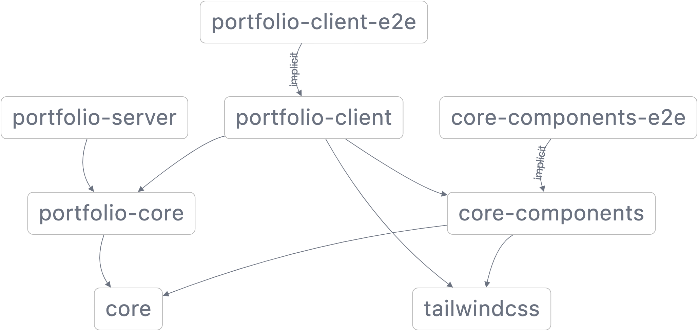

# VENKATASUDHA

venkatasudha is a mono repository that contains all javascript and typescript based web applications and libraries.

## Applications Included

- **_core-components-e2e(packages/apps/core-components-e2e)_** - Cypress bases end to end testing application for `core-components` library

- **_portfolio-client(packages/apps/portfolio-client)_** - Next JS based PWA web UI for user portfolio

- **_portfolio-client-e2e(packages/apps/portfolio-client-e2e)_** - Cypress bases end to end testing application for `portfolio-client` library

- **_portfolio-server(packages/apps/portfolio-server)_** - Nest JS based GraphQL server to provide data to be displayed by `portfolio-client`

## Libraries Included

- 
  **_core(packages/libs/core)_** - pure typescript based library that includes all utility functions that other libraries or applications might use.

-  **_core-components(packages/libs/core-components)_** - React based components library that Next or React based clients can use.

-  **_portfolio-core(packages/libs/portfolio-core)_** - pure typescript based library that includes all util functions and entities required specifically for portfolio frontend and backend (UI and server)

- 
  **_tailwindcss(packages/libs/tailwindcss)_** - tailwind library that includes common preset and css file that UI applications or libraries can use for design.

## Scripts

- `clean` - removes all build, coverage, cypress and temporory files

- `validate:push` - runs all required scripts to check if github workflow would pass before pushing commit to remote url

- `build:all` - runs build script on all affected components

- `lint:all` - runs lint script on all affected components

- `test:all` - runs unit test on all affected components

- `e2e:all` - runs e2e tests on all affected components

- `serve:portfolio` - script to build and serve production based next application

> NOTE: All `nx` affected script above are based of `dev` branch by default, If you would like to change this update `affected/defaultBase` property within `nx.json` file.

## Projects Dependency Graph

## Dependency Versions

Dependencies and their specific versions used in this repo are listed below.

